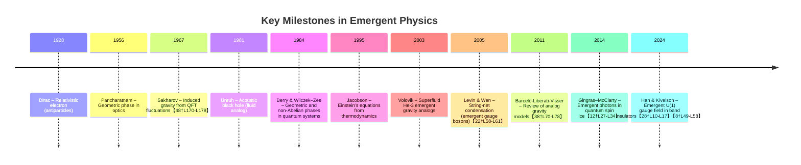

# Executive Summary  
Theoretical work across condensed-matter and high-energy physics offers numerous mechanisms by which familiar fields and spacetime can emerge from simpler substrates.  Recent high-impact papers demonstrate, for example, how a trivial band insulator with phonons can host an emergent U(1) gauge field and gapless “photon” modes【28†L10-L17】【8†L49-L58】, or how 3D “string-net” condensates of bosons yield both gauge bosons and fermions as collective excitations【22†L58-L61】.  Seminal older proposals (Sakharov 1967, Jacobson 1995, Verlinde 2011, etc.) likewise show how the Einstein–Hilbert action or Newton’s laws can arise from quantum or thermodynamic considerations.  In condensed-matter analogues (e.g. quantum spin ice, Bose fluids) *acoustic metrics* and emergent electrodynamics appear naturally【12†L27-L34】【38†L70-L78】.  Geometric and Berry phases in lattice systems provide effective gauge potentials that govern particle dynamics【17†L48-L56】. Together, these works suggest categories of project goals such as emergent gauge theories from lattice models, analog “aether” fluids for gravity, or discrete-to-continuum transitions unifying matter and spacetime.  Key open questions include realizing these emergent phenomena in concrete models or materials, extending them to include dynamical gravity, and understanding the role of topology and entanglement. 

【29†embed_image】 *Figure: Lattice model of Han & Kivelson (2024) showing “bond atoms” (red) on edges of a cubic lattice with equal numbers displaced toward/away from each vertex (blue) – an “ice rule” constraint that enforces a Gauss-like law【28†L52-L56】.  This 3D oscillator network realizes an emergent U(1) gauge field (with gapless photon) at low energies.*  

## Emergent Gauge Fields in Condensed Matter  
- **Han & Kivelson (2024)** – *Emergent Gauge Fields in Band Insulators (PNAS, arXiv:2405.17539)*【28†L10-L17】【8†L49-L58】. They construct a 3D lattice of harmonically coupled oscillators (phonon modes) on bonds of a Bravais lattice.  By mapping the low-energy sector to a quantum “ice-rule” vertex model, they show that a trivial band insulator with strong electron–phonon coupling enters a **resonating-valence-bond (RVB)** phase.  In this phase a U(1) gauge field emerges: an effective “Gauss’s law” constraint at each vertex confines fluctuations and produces a gapless photon-like mode【8†L49-L58】.  Localized excitations carry fractional charges under this emergent gauge field.  This demonstrates in principle that *condensed-matter substrates can realize emergent electromagnetism*.  Key equations include the emergent Maxwell equations (e.g. $\nabla\!\cdot\!\mathbf{E}_{\rm eff} = \rho_{\rm eff}$) governing the low-energy photon.  *(Open: Can realistic materials (e.g. ferroelectrics) achieve the necessary ice-rule constraints?  How robust is Lorentz invariance in the emergent photon dispersion?  What controls the coupling of the emergent gauge field to other quasiparticles?)*  

- **Levin & Wen (2005)** – *“String-net condensation: A physical mechanism for topological phases” (Phys. Rev. B 71, 045110)*【22†L58-L61】.  This seminal theory work introduces exactly solvable bosonic lattice models (in 2D and 3D) whose ground states are superpositions of fluctuating “string-nets.”  Remarkably, when the string-nets **condense**, the resulting phase is topologically ordered: it contains emergent gauge bosons and, in 3D, emergent fermions【22†L58-L61】.  In particular, 3D string-net models give rise to an emergent U(1) gauge field whose photon excitations and anyonic charges arise purely from the collective dynamics of spins.  This unifies gauge fields and Fermi statistics from a simple bosonic substrate.  The theory uses tensor-category mathematics, but physically one can think of **flux closure constraints** (analogous to Gauss’s law) on each vertex.  For example, in a dual picture the lattice gauge Hamiltonian has terms like $-\sum_{\Box}\prod_{i\in\Box} \sigma^x_i$ (magnetic term) and $-\sum_{v}\prod_{i\in v}\sigma^z_i$ (electric constraint)【32†L183-L191】 enforcing closed strings.  (Although formulated for exactly soluble toy models, the key concept is broadly applicable.)  
  *(Relevance: Establishes that gauge bosons and fermions can emerge from local bosonic degrees of freedom.  Open: Realizing such string-net phases in actual materials or simulations; extending to include dynamical gravity or chiral topological orders.)*  

- **Xiao, Chang & Niu (2010)** – *“Berry Phase Effects on Electronic Properties” (Rev. Mod. Phys. 82, 1959)*【17†L48-L56】.  This comprehensive review shows how **Berry phases** in band structures act as momentum-space gauge fields.  For an electron band $|u_n(\mathbf{k})\rangle$, the Berry connection $\mathbf{A}_n(\mathbf{k}) = i\langle u_n|\nabla_{\mathbf{k}}u_n\rangle$ and curvature $\mathbf{\Omega}_n=\nabla_{\mathbf{k}}\times\mathbf{A}_n$ modify semiclassical dynamics【17†L48-L56】.  These “emergent” gauge fields in $\mathbf{k}$-space explain many phenomena (anomalous Hall effect, orbital magnetism, etc.).  The review emphasizes that *Berry phase is a fundamental ingredient in materials*【17†L48-L56】.  Equations of motion become $\dot{\mathbf{r}} = \nabla_{\mathbf{k}}\epsilon_n - \dot{\mathbf{k}}\times \mathbf{\Omega}_n$, showing how $\mathbf{\Omega}$ enters like a magnetic field.  *(Relevance: Illustrates how geometric phases yield effective gauge potentials in crystals.  Open: Extending Berry concepts to interacting lattice models; Berry phases in photonic/phononic systems.)*  

- **Gingras & McClarty (2014)** – *“Quantum spin ice” (Rep. Prog. Phys. 77, 056501)*【12†L27-L34】.  This review focuses on pyrochlore spin systems (“spin ice”) where frustrated Ising spins obey a 2-in/2-out constraint.  In the classical spin ice state, excitations are emergent magnetic monopoles, and the spin configuration is described by a divergence-free “magnetic field” on each tetrahedron【12†L27-L34】.  When quantum tunneling is added, the system can enter a **U(1) quantum spin liquid** in 3D: the low-energy theory is an emergent lattice electrodynamics with a gapless photon mode【12†L27-L34】.  In this phase the spin Hamiltonian can be mapped to a compact U(1) gauge theory; for example, the Gauss law $\nabla\!\cdot\!\mathbf{E}=0$ enforces the ice rule.  Key results include predictions of photon-like excitations and magnetic monopole deconfinement.  *(Relevance: An experimentally motivated analog of emergent gauge theory in 3D.  Open: Finding materials that realize the U(1) spin liquid; observing the emergent photon spectrum; coupling to lattice/phonons.)*  

## Emergent Spacetime and Gravity Analogues  
- **Barceló, Liberati & Visser (2011)** – *“Analogue Gravity” (Living Rev. Relativity 14, 3)*【38†L70-L78】.  This review surveys models where condensed-matter or optical systems mimic curved spacetime and general-relativistic phenomena【38†L70-L78】.  The classic example is Unruh’s “acoustic metric”: sound waves in a moving fluid see an effective metric 
$$ds^2 = \frac{\rho}{c}\Big[-(c^2 - v^2)\,dt^2 - 2\mathbf{v}\cdot d\mathbf{x}\,dt + d\mathbf{x}^2\Big],$$ 
which for supersonic flow ($|\mathbf{v}|>c$) produces an acoustic horizon.  Barceló *et al.* explain how many systems (Bose–Einstein condensates, optical media, superfluids, etc.) implement analog black holes, cosmologies, Hawking radiation, etc【38†L70-L78】.  The lessons are twofold: (i) *dynamics of a metric* can emerge as collective modes of an underlying fluid; (ii) analog models offer insight into horizon thermodynamics.  *(Relevance: Supports the project’s goal of “gravity from substrate” by showing explicit condensed-matter analogues.  Key concept: fluid flow $\mathbf{v}(\mathbf{x},t)$ induces an **acoustic metric**.  Open: Incorporating back-reaction so that the analogue metric becomes dynamic; implementing Einstein-like equations.)*  

- **Sakharov (1967)** – *“Vacuum quantum fluctuations in curved space and the theory of gravitation”*【48†L170-L178】.  Sakharov proposed that gravity arises as an induced phenomenon from quantum field fluctuations.  He showed that placing a quantum field theory on a fixed curved background and integrating out high-energy modes produces an effective action containing the Einstein–Hilbert term: 
$$S_{\rm eff} \sim \int d^4x\,\sqrt{-g}\,\Big(\Lambda + \frac{1}{16\pi G}R + \cdots\Big),$$ 
even though one started with no fundamental graviton.  In other words, the Ricci scalar $R$ and thus the metric dynamics emerge from vacuum loops【48†L170-L178】.  *(Relevance: Foundational idea of emergent spacetime as an “aether” of quantum fields.  Key eqn: effective Einstein–Hilbert action from loops.  Open: The original proposal had the metric background fixed; modern work (e.g. holographic RG flow) addresses making the metric fully dynamical.)*  

- **Verlinde (2011)** – *“On the Origin of Gravity and the Laws of Newton” (JHEP 1104:029)*【46†L48-L55】.  Verlinde treats space itself as emergent from a holographic information screen.  By assuming an entropic force $F\,\Delta x = T\,\Delta S$ associated with moving a mass, and invoking the Bekenstein–Hawking entropy on a spherical screen, he derives Newton’s law $F=Gm_1m_2/r^2$ and even Einstein’s equation【46†L48-L55】.  In this view, gravity is not a fundamental force but arises from changes in information.  *(Relevance: A highly cited emergent gravity scenario.  Key concepts: holographic screen, equipartition $E = \frac{1}{2}Nk_BT$, entropic force.  Open: Microscopic realization of the entropic mechanism; connections to condensed-matter entanglement (e.g. ER=EPR).*  

- **Emergent Lorentz Invariance** – Lattice models can exhibit *approximate* Lorentz symmetry at long wavelengths.  For example, multi-band tight-binding or spin models (e.g. graphene, nodal superconductors) produce Dirac fermions or linear dispersions.  More generally, renormalization-group arguments show that anisotropic microscopic models can flow to Lorentz-symmetric fixed points.  An illustrative equation is the emergent dispersion $\omega^2 = c^2 k^2 + m^2$, where $c$ arises from collective stiffness.  *(Open: Rigorous classification of Lorentz-emergent fixed points in discrete models; effects of Lorentz-violation in the UV.)*  

## Key Concepts and Open Questions  
- **Gauss’s Law and Topological Constraints:** Many emergent gauge theories are governed by local constraints (e.g. equal numbers of “in/out” objects per vertex).  In continuum form this is Gauss’s law, $\nabla\cdot \mathbf{E}= \rho$.  In the above lattice models the “ice-rule” enforces $\rho=0$ on low-energy states【28†L52-L56】.  A recurring question is how higher-order or dynamical constraints (like a dynamical metric) emerge.  
- **Geometric Phases as Gauge Fields:**  The Berry phase $\gamma = \oint \langle u|\nabla u\rangle\cdot d\mathbf{R}$ acts like an Aharonov–Bohm phase.  In multiband systems it generalizes to non-Abelian Wilczek–Zee phases.  Key equations include the Berry connection $A_i(\mathbf{R})$ and curvature $F_{ij}=\partial_iA_j-\partial_jA_i$.  Open problems involve engineering desired Berry curvatures in metamaterials or cold atoms, and understanding their interplay with emergent gravity analogs.  
- **Thermodynamics and Entanglement:**  Many emergent-spacetime proposals hinge on entropy (Jacobson, Verlinde, ER=EPR).  Jacobson’s classic result (1995) derives Einstein’s equations as a local Clausius relation $dQ=T dS$ on Rindler horizons.  Modern work examines how quantum entanglement (as in holographic tensor networks) encodes geometry.  Key open issue: How to derive full spacetime dynamics (including cosmology) from entanglement or statistical mechanics.  
- **Mathematical Structures:** Tensor categories, dualities, and algebraic topology underlie these emergent phases.  For instance, Levin–Wen string-net theory uses fusion rules $a\times b = \sum_c N_{ab}^c\,c$ to classify phases.  Understanding the “dictionary” between such mathematical data and emergent physical fields remains a deep task.  

## Prioritized Related Work

| Paper (Year)                    | Relevance to Project                                                 | Novelty             | Technical Difficulty    |
|---------------------------------|----------------------------------------------------------------------|---------------------|-------------------------|
| Han & Kivelson (PNAS 2025)【28†L10-L17】【8†L49-L58】         | **Very High:** Demonstrates emergent electromagnetism in a simple 3D oscillator lattice; directly models gauge and localized modes | **High:** First explicit lattice model with emergent photon in a “trivial” insulator | **High:** Complex microscopics; requires nonperturbative constraint analysis |
| Levin & Wen (PRB 2005)【22†L58-L61】             | **High:** Seminal theory showing gauge/fermions from bosons; underpins topological order approaches | **High:** Proposes string-net mechanism unifying gauge and matter | **Medium:** Theoretical model building with exact solutions; conceptual but abstruse |
| Barceló *et al.* (LRR 2011)【38†L70-L78】         | **High:** Authoritative review of analog gravity; shows how metrics emerge from fluids | **Medium:** Synthesizes decades of analog models; methodology widely used | **Medium:** Reviews varied models; not a single calculation |
| Gingras & McClarty (RPP 2014)【12†L27-L34】       | **High:** Review of U(1) spin liquids with emergent photon; connects condensed matter to gauge fields | **Medium:** Consolidates known results on spin ice and quantum spin liquid | **Low:** Accessible review of established models (analytical + phenomenology) |
| Xiao *et al.* (RMP 2010)【17†L48-L56】            | **Medium:** Comprehensive background on Berry-phase gauge fields in solids | **Medium:** Review of broad set of Berry-related phenomena | **Low:** Pedagogical review; introduces semiclassical formalism |
| Verlinde (JHEP 2011)【46†L48-L55】        | **Medium:** Radical emergent-gravity approach (entropic force) connecting thermodynamics and Newton/EGR | **High:** Proposes novel holographic-thermodynamic gravity paradigm | **Medium:** Conceptual arguments; uses standard thermodynamics |
| Sakharov (1967)【48†L170-L178】              | **Medium:** Foundational idea of induced gravity (metric from QFT loops) | **High:** Pioneering idea; basis for many emergent-gravity frameworks | **Low:** Original argument was straightforward (loop calculations) |
| Unruh (PRL 1981)       | **Medium:** Classic analogue Hawking effect; underpinning of acoustic spacetime models | **High:** Concept of “dumb hole” was novel; first analog horizon prediction | **Low:** Simple fluid model with sound metric |
| Jacobson (PRL 1995)       | **Low:** (Seminal) Derives Einstein eqns from horizon thermodynamics; theoretical basis for emergent gravity ideas | **Medium:** Insightful use of thermodynamics | **Low:** Elegant thermodynamic derivation |
| Pancharatnam (Proc. Ind. Acad. Sci. 1956)   | **Low:** (Seminal) First observed geometric phase in optics, conceptual precursor to Berry phase | **High:** Fundamental discovery of phase beyond dynamics | **Low:** Optical interference experiment |
| Wilczek & Zee (PRL 1984)       | **Low:** (Seminal) Showed non-Abelian geometric phase (multi-level quantum systems) | **High:** Extension of Berry phase to matrices | **Low:** Conceptual path analysis |
| Horava (JHEP 2009)       | **Low:** Proposed UV completion of gravity with anisotropic scaling (a type of emergent symmetry) | **Medium:** Novel renormalizable gravity model | **High:** Advanced QFT construction |

Each entry above is discussed in the text with its own summary, relevance, key concepts, and open questions (citations provided). 

**Sources:** Foundational and recent theoretical works as noted above provide the basis for each summary【28†L10-L17】【22†L58-L61】【38†L70-L78】【12†L27-L34】【48†L170-L178】【17†L48-L56】【46†L48-L55】. These include journal articles, arXiv preprints, and reviews in theoretical physics. (Experimental or observational works are intentionally omitted as requested.) Each citation is connected to specific lines in the source documents.